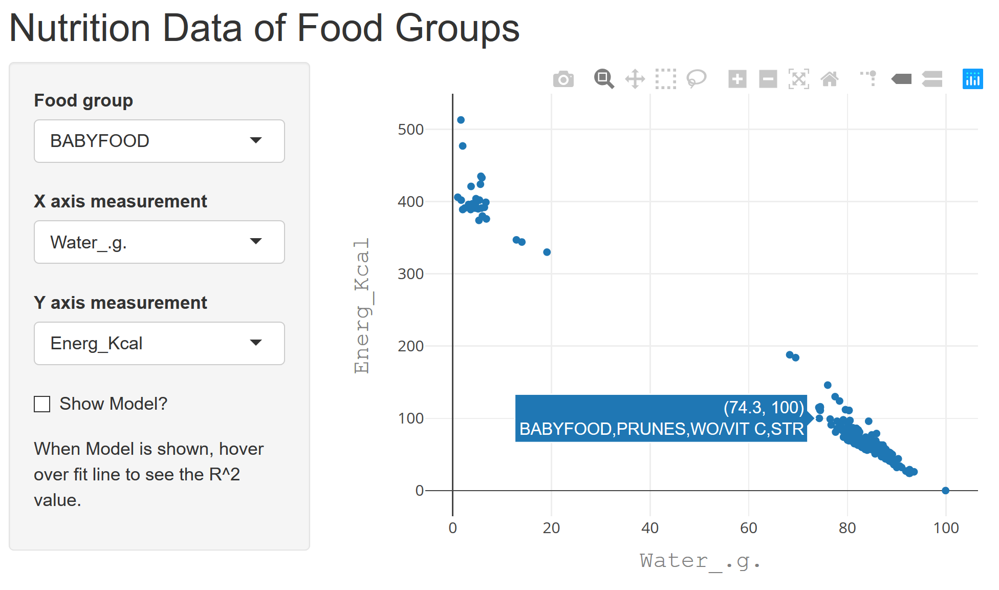
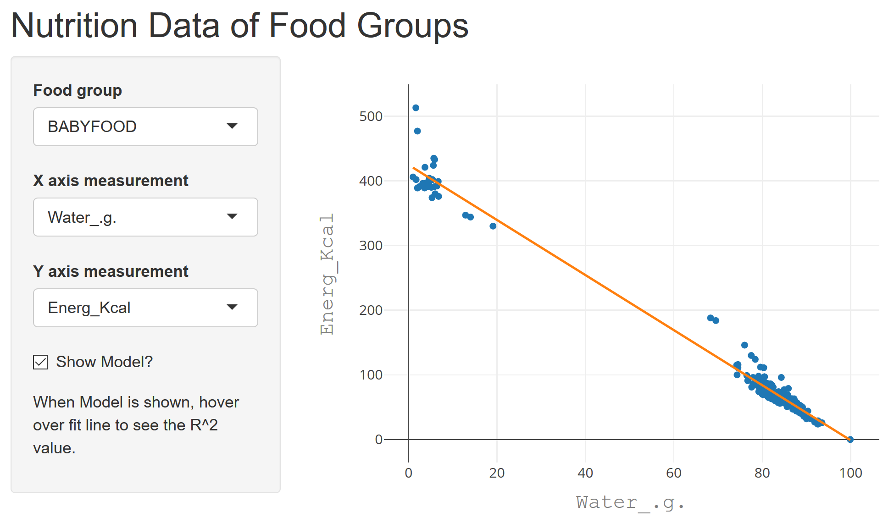

<style type="text/css">

body{ /* Normal  */
      font-size: 12px;
  }
td {  /* Table  */
  font-size: 8px;
}
h1.title {
  font-size: 38px;
  color: DarkRed;
}
h1 { /* Header 1 */
  font-size: 28px;
  color: White;
}
h2 { /* Header 2 */
  color: White;
}
h3 { /* Header 3 */
  font-size: 18px;
  font-family: "Times New Roman", Times, serif;
  color: DarkBlue;
}
code.r{ /* Code block */
    font-size: 16px;
    color: white;
    font-weight: bold;
}
pre { /* Code block - determines code spacing between lines */
    font-size: 16px;
    color: white;
    font-weight: bold;
}
p{
    color:White;
    font-size: 28px;
    font-weight: bold;
}
ul{
    color:White;
    font-size: 28px;
    font-weight: bold;
}
</style>

```{r setup, include=FALSE}
knitr::opts_chunk$set(echo = FALSE)
```

## Overview {data-background=images/foods.jpg data-background-size=cover}

Problem: How can we understand the complexity of nutritional information? Do any of these variables correlate?

We want to be able to:

- Assess nutritional value of different food groups
- Observe how different nutrients relate to each other
- Make predictions based on this information

## Nutritional Variables {data-background=images/foods.jpg data-background-size=cover}

```{r, echo = TRUE}
data <- read.csv("Nutrition/data/nutritionClean.csv")[,c(-1,-2)]
head(names(data),30)
```

## Interactive user interface {data-background=images/foods.jpg data-background-size=cover}

```{r echo=FALSE, fig.cap="Example of UI", out.width = '100%'}

```


## Linear model fitting with R^2 value {data-background=images/foods.jpg data-background-size=cover}

```{r echo=FALSE, fig.cap="Example of UI", out.width = '100%'}

```

## Thanks {data-background=images/foods.jpg data-background-size=cover}

Thanks to everyone's support, this project was possible.

- My mom
- My boss
- You!


